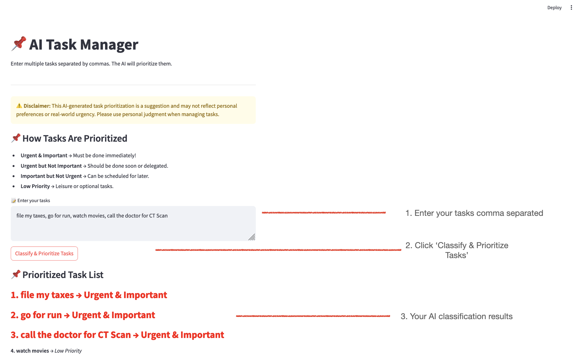

# AI Task Manager

Manage your daily tasks through AI. 

This project helps prioritize tasks based on urgency and importance using AI. It takes a list of tasks you enter, analyzes them, and then sorts them into categories to help you decide what to do first. The categories are:

    Urgent & Important: Must be done immediately!
    Urgent but Not Important: Should be done soon or delegated.
    Important but Not Urgent: Can be scheduled for later.
    Low Priority: Leisure or optional tasks.

# Features

* AI-Powered Task Prioritization: The AI model evaluates your tasks and sorts them based on urgency and importance.
* Streamlit Interface: An easy-to-use interface where you can input your tasks and view the prioritized list.
* Zero-Shot Classification: This AI model understands the context of your tasks and categorizes them.

# How to run?

`streamlit run streamlit_app/app.py`

# Sample Expected Outputs



# Project Directory Structure
```
ai-task-manager/
│
├── model_code/
│   └── download_model.py
│
├── streamlit_app/
│   └── app.py
│
├── local_model/  # This folder will be generated after running the download_model.py script
│
├── requirements.txt
└── README.md
```


# Model Information - Hugging Face

https://huggingface.co/facebook/bart-large-mnli

https://huggingface.co/tasks/zero-shot-classification
